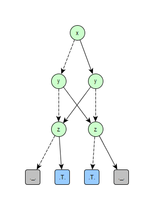

# Binary Decision Diagrams (bdd-racket)

This is experimental library which implements _Binary Decision Diagrams_
(_BDD_) in [Racket](https://racket-lang.org) programming language.
This is not production library. It will be changed without preserving
backward compatibility in the future. Library implements **Reduced
Ordered Binary Decision Diagrams** (**ROBDD**). My intent is to add
implementation of the **Zero-Suppressed Binary Decision Diagrams**
(**ZDD**) and functions transforming ROBDD into ZDD and vice versa.
I was inspired by the paper [1].

## License

This code is released under MIT License.

Copyright (c) 2016 Peter Cerman (https://github.com/pcerman)

## Example of use
```Racket
(require "robdd.rkt")

(define ex '(xor (xor x y) z))

;; create ROBDD for this boolean expression
(define bdd (make-robdd ex '(x y z)))

;; create graph representation of this ROBDD and write it into the file
(robdd->tgf bdd "bdd.tgf" '(x y z))

;; count number of solutions which evaluates to boolean value true
(robdd-sat-count bdd 3)
;; it returns: 4

;; transform ROBDD into boolean expression
(robdd->b-expr bdd '(x y z))
;; it returns: '(or (and x (or (and y z) (and (not y) (not z))))
;;                  (and (not x) (or (and y (not z)) (and (not y) z))))
```

ROBDD graph representation from example: 

### References

1. Henrik Reif Andersen, An Introduction to Binary Decision Diagrams. Lecture
   notes for 49285 Advanced Algorithms E97, October 1997. Department of
   Information Technology, Technical University of Denmark
