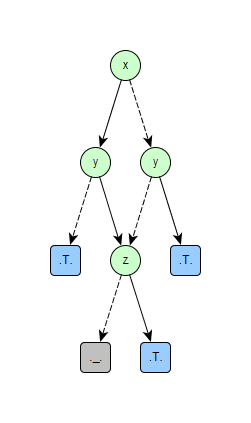

# Binary Decision Diagrams (bdd-racket)

This is experimental library which implements _Binary Decision Diagrams_
(_BDD_) in [Racket](https://racket-lang.org) programming language.
This is not production library. It will be changed without preserving
backward compatibility in the future. Library implements **Reduced
Ordered Binary Decision Diagrams** (**ROBDD**) and  **Zero-Suppressed
Binary Decision Diagrams** (**ZDD**). My intent is to add implementation of
functions transforming ROBDD into ZDD and vice versa. I was inspired
by papers [1], [2].

## License

This code is released under MIT License.  
Copyright (c) 2016 Peter Cerman (https://github.com/pcerman)

## Example of use

_ROBDD_
```Racket
(require "bdd.rkt" "robdd.rkt")

(define ex '(xor (xor x y) z))

;; create ROBDD for this boolean expression
(define bdd (make-robdd ex '(x y z)))

;; create graph representation of this ROBDD and write it into the file
(bdd->tgf bdd "bdd.tgf" '(x y z))

;; count number of solutions which evaluates to boolean value true
(robdd-sat-count bdd 3)
;; it returns: 4

;; transform ROBDD into boolean expression
(robdd->b-expr bdd '(x y z))
;; it returns: '(or (and x (or (and y z) (and (not y) (not z))))
;;                  (and (not x) (or (and y (not z)) (and (not y) z))))
```
Graph representation of the ROBDD from example:  


_ZDD_
```Racket
(require "bdd.rkt" "zdd.rkt")

(define ex '(xor (xor x y) z))

;; create ZDD for this boolean expression
(define zdd (make-zdd ex '(x y z)))

;; create graph representation of this ZDD and write it into the file
(bdd->tgf zdd "zdd.tgf" '(x y z))

;; count number of solutions which evaluates to boolean value true
(zdd-count zdd)
;; it returns: 4

;; transform ZDD into boolean expression
(zdd->b-expr zdd '(x y z))
;; it returns: '(or (and x (or (and y z) (and (not y) (not z))))
;;                  (and (not x) (or (and y (not z)) (and (not y) z))))
```
Graph representation of the ZDD from example. It represents subset
{ {x}, {y}, {z}, {x,y,z} } of powerset from {x,y,z}.  


### References

1. Henrik Reif Andersen, An Introduction to Binary Decision Diagrams, Lecture
   notes for 49285 Advanced Algorithms E97, October 1997, Department of
   Information Technology, Technical University of Denmark
2. Shin-ichi Minato, Zero-suppressed BDDs and their applications, International
   Journal on Software Tools for Technology Transfer, May 2001, Volume 3,
   Issue 2, pp 156–170, doi:10.1007/s100090100038
